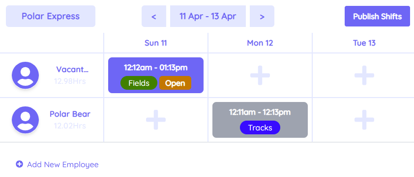
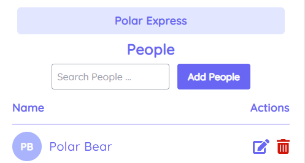
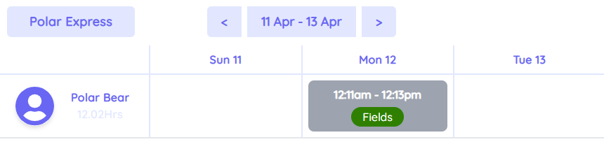

# [🚀 DShift](https://dshift.netlify.app/)

Voyage-28 | [chingu.io](https://chingu.io/) | [Twitter](https://twitter.com/ChinguCollabs)

### Better direct your company's shifts with peace of mind.

<a href="https://dshift.netlify.app/" target="_blank">
  

    
  

</a>

We made a blazing fast shift management web app sporting a surprisingly simple interface. Built using Svelte Kit & Tailwind!

**[See it live!](https://dshift.netlify.app/)**

## [Project Process](https://www.notion.so/Project-Process-DShift-Manager-MVP-34842eae7df6433c9fabc009394810db)

This page summarizes our entire project process, including design, deploy, and feature development considerations.

### [Design](https://www.notion.so/Project-Process-DShift-Manager-MVP-34842eae7df6433c9fabc009394810db#a010dbb82841401cad0a26557bf6902d)

### [Deploy Instructions](https://www.notion.so/Project-Process-DShift-Manager-MVP-34842eae7df6433c9fabc009394810db#7450c38b0c8941978cf3a6a139aff610)

### [Features](https://www.notion.so/DShift-Features-101a9d8d6580408eac8ce6322122d907)

Sign in and manage your employees to try it out! It's far more impressive in person.

Schedule page: Manage your company's shifts

- Left/right date navigation
- Calendar date picker
- Publish modal
- Fully responsive shift grid (adjusts # of days)
  - Vacant shifts
  - Employees & hourly wages (if specified)
  - Shift adding/editing view (published, unpublished, and add buttons)
    - Shift modal (update & add shifts/areas)
    - Area modal (batch edit/add)
- Add employee modal (batch)
- (experimental) `/labs/schedule` - drag and drop shift updating

People page: Manage your employees

- Employee filtering
- Add employee modal (full detail modification)
- List of all employees
  - Edit employee modal
  - Employee deletion

Published page: Employee's public page to view your company's published shifts

The display is similar to the schedule page but takes away all editing capabilities and only allows viewing published shifts for employees.

## **Tech**

**Frontend**

[Svelte](https://svelte.dev/)

[Svelte Kit](https://kit.svelte.dev/docs)

[urql](https://formidable.com/open-source/urql/)

**Styles** [TailwindCSS](https://tailwindcss.com/)

**Database** [Fauna](https://fauna.com/) ([GraphQL](https://graphql.org/) frontend & FQL + serverless functions)

**Platform** [Netlify](https://www.netlify.com/)

**Architecture** [Jamstack](https://jamstack.org/) ([Serverless](https://serverless.css-tricks.com/), so hot right now 🌶. Serverless)

**Dates** [Day.js](https://day.js.org/)

**Project Management** [Notion](https://www.notion.so/)
